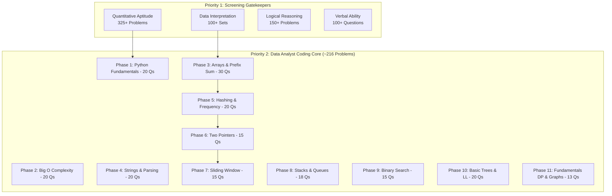

# 🎯 DSA + APTITUDE INTENSIVE PREPARATION SYSTEM (DSA-APS)
## Placement Operating System for Data Analyst, BI Analyst & Analytics Roles

---

## 📌 1. EXECUTIVE TARGET & PLACEMENT BLUEPRINT

* **Target Roles:** Data Analyst | BI Analyst | Power BI Analyst | Analytics Associate | Junior Data Analyst | Data Engineer Trainee
* **Core Pipeline:**
  $$\text{Aptitude Screening} \longrightarrow \text{Coding / Python Assessment} \longrightarrow \text{SQL Round} \longrightarrow \text{Technical / Case Study} \longrightarrow \text{HR}$$
* **Core Philosophy:** No hardcore SDE competitive programming. Optimize 100% for Analytics assessments, speed, data interpretation, SQL thinking, and business logic.
* **Master Performance Score Formula:**
  $$\text{Total Score} = 0.25(\text{Aptitude}) + 0.20(\text{DSA Acc}) + 0.10(\text{DSA Speed}) + 0.15(\text{SQL}) + 0.10(\text{DI}) + 0.10(\text{LR}) + 0.10(\text{Comms})$$

---

## 🧭 2. COMPLETE ROADMAP HIERARCHY



---

## 🛠️ 3. NON-NEGOTIABLE COACHING PROTOCOL

1. **Anti-Solution Rule:** Solutions are never revealed immediately. You must attempt first.
2. **4-Tier Hint System:**
   * **Hint 1:** Conceptual & Mathematical clue.
   * **Hint 2:** Algorithmic approach (e.g., "Use Hash Map instead of nested loops").
   * **Hint 3:** Step-by-step Pseudocode.
   * **Final:** Full Python code + Complexity + Edge cases (only on explicit request or successful attempt).
3. **Data Analyst Context Integration:** Every coding problem is framed around realistic transactional, customer, financial, or time-series data.
4. **SQL vs Python Decision Rule:** Always evaluate whether a problem is best solved via Python algorithm, Pandas vectorization, or SQL Window functions.

---

## 📋 4. PROBLEM INVENTORY & VOLUME TARGETS

| Domain / Topic | Target Volume | Key Focus Areas |
| :--- | :---: | :--- |
| **Python Fundamentals** | 20 | List comprehensions, Dict manipulation, Slicing, Error handling |
| **Time & Space Complexity** | 20 | Big-O analysis, Worst/Average case, Space tradeoffs |
| **Arrays & Matrix** | 30 | Kadane's, Two Sum, Leaders, Stock Buy/Sell, Missing/Duplicate |
| **Strings** | 20 | Anagrams, Palindromes, Reversal, Substring matching |
| **Hashing & Frequency Maps**| 20 | Reducing $O(n^2) \to O(n)$, Group anagrams, Subarray sum |
| **Two Pointers & Sliding Window** | 30 | Sorted pair search, Max sum of K, Longest substring |
| **Stack & Queue** | 18 | Valid parentheses, Min stack, Next greater element, BFS queues |
| **Binary Search** | 15 | Lower/Upper bound, Rotated sorted search, Square root space |
| **Linked List & Trees** | 20 | Cycle detection, Reversal, Tree traversals, Max depth, BST search |
| **Quantitative Aptitude** | 325+ | Percentages, Profit & Loss, Ratios, Averages, SI/CI, Time & Work, Speed |
| **Data Interpretation (DI)** | 100 Sets | Tables, Bar, Line, Pie, Histograms, Mixed Caselets, Growth/CAGR |
| **Logical Reasoning** | 150+ | Seating arrangement, Syllogisms, Blood relations, Series, Directions |
| **Verbal Ability** | 100+ | Reading comprehension, Sentence correction, Para jumbles |

---

## 📊 5. DAILY TRAINING DRILL STRUCTURE (25 Aptitude + 3 DSA)

### 📅 Daily Quota:
* **Quantitative:** 10 Questions
* **Logical Reasoning:** 5 Questions
* **Data Interpretation:** 5 Questions (1 Full Set)
* **Verbal:** 5 Questions
* **Python DSA:** 1 Easy + 1 Easy/Med + 1 Medium

---

## 📝 6. ERROR TRACKER & PATTERN NOTEBOOK SCHEMA

```text
| Date | Problem / Topic | Type (DSA/Apt) | Difficulty | My Initial Approach | Root Cause Mistake | Correct Pattern | Time Taken | Retry Date |
|------|-----------------|----------------|------------|---------------------|--------------------|-----------------|------------|------------|
```
*Mistake Classifications:* `[Concept]` | `[Logic]` | `[Calculation / Arithmetic]` | `[Edge-Case]` | `[Time Complexity]` | `[Misread Question]`

---
*Roadmap initialized by AI Data Career Operating System. Ready for Day 1 Execution.*
