# 🚀 AI DATA CAREER OPERATING SYSTEM (AI-DCOS)
## Complete Master PRD, 32-Stage Roadmap, Project Engine & Evaluation Framework

---

## 📌 1. EXECUTIVE SUMMARY & TARGET ARCHITECTURE

* **Primary Career Objective:** Data Analyst / BI Analyst / Power BI Analyst
* **Primary Certification:** **Microsoft PL-300** (Power BI Data Analyst Associate)
* **Long-Term Target:** Analytics Engineer → Data Engineer
* **Certification Progression:** **PL-300** (BI Analyst) ➔ **DP-600** (Fabric Analytics Engineer) ➔ **DP-700** (Fabric Data Engineer)
* **Core Philosophy:** 70% Hands-on Projects | 20% Problem Solving | 10% Targeted Theory
* **Standard Rule:** No random tool learning. Every concept is connected to the end-to-end data lifecycle:
  $$\text{Source} \to \text{Ingestion} \to \text{Raw} \to \text{Clean} \to \text{Model} \to \text{Transform} \to \text{Semantic Model} \to \text{BI / Dashboard} \to \text{Business Impact}$$

---

## 🧭 2. THE 32-STAGE MASTER LEARNING PATHWAY

```mermaid
graph TD
    subgraph "Phase 1: BI & Analytics Core (PL-300 Target)"
        M1[01. Excel Foundations] --> M2[02. Business Statistics]
        M2 --> M3[03. SQL Fundamentals]
        M3 --> M4[04. Data Cleaning & Integrity]
        M4 --> M5[05. Power Query & M Engine]
        M5 --> M6[06. Data Modeling & Star Schema]
        M6 --> M7[07. Power BI Visuals & UI/UX]
        M7 --> M8[08. DAX Calculation Engine]
        M8 --> M9[09. Power BI Service & Governance]
        M9 --> M10[10. PL-300 Exam Certification Mode]
    end

    subgraph "Phase 2: Analytics Engineering & Automation"
        M10 --> M11[11. Python Fundamentals]
        M11 --> M12[12. Pandas & Data Wrangling]
        M12 --> M13[13. PostgreSQL Deep-Dive]
        M13 --> M14[14. REST APIs & Ingestion]
        M14 --> M15[15. Data Pipeline Automation]
        M15 --> M16[16. Advanced SQL & Optimization]
        M16 --> M17[17. Git & Collaborative Workflows]
        M17 --> M18[18. Modern Data Warehousing]
        M18 --> M19[19. Advanced Dimensional Modeling]
        M19 --> M20[20. dbt Analytics Engineering]
        M20 --> M21[21. Enterprise ETL / ELT Patterns]
    end

    subgraph "Phase 3: Microsoft Fabric & Big Data (DP-600 & DP-700 Target)"
        M21 --> M22[22. Microsoft Fabric Architecture]
        M22 --> M23[23. OneLake & Open Lakehouse]
        M23 --> M24[24. Medallion Lakehouse Engine]
        M24 --> M25[25. Fabric Data Pipelines]
        M25 --> M26[26. Dataflows Gen2]
        M26 --> M27[27. PySpark & Delta Lake]
        M27 --> M28[28. Real-Time Analytics & KQL]
        M28 --> M29[29. Pipeline Monitoring & Health]
        M29 --> M30[30. Data Quality & Great Expectations]
        M30 --> M31[31. Security, RLS & Governance]
        M31 --> M32[32. Production Data Engineering Capstone]
    end
```



---

## 🛠️ 3. THE 11-PART PEDAGOGICAL TEACHING RULE

Every single concept throughout this curriculum is delivered using this rigorous 11-step framework:

1. **CONCEPT:** Clear, concise technical definition.
2. **WHY IT EXISTS:** The specific engineering/business failure it resolves.
3. **BUSINESS USE CASE:** Real-world domain scenario (Retail, FinTech, SaaS, Healthcare).
4. **SYNTAX / TOOL:** Code structure, keyboard shortcuts, or UI paths.
5. **SMALL EXAMPLE:** Step-by-step walk-through on micro-data.
6. **HANDS-ON TASK:** Challenge prompt for the student to solve.
7. **MINI PROJECT:** Integration into an ongoing portfolio project.
8. **INTERVIEW QUESTION:** Real technical/scenario interview question with model answer.
9. **REAL-WORLD SCENARIO:** Case study of production failure and mitigation.
10. **COMMON MISTAKES:** Anti-patterns, bugs, and best-practice corrections.
11. **ASSESSMENT:** 3-question diagnostic checkpoint before unlocking the next topic.

---

## 📁 4. PRODUCTION-GRADE 12-PROJECT PORTFOLIO ENGINE

| # | Project Title | Primary Stack | Domain | Key Business Deliverables |
|---|---|---|---|---|
| **01** | **Executive Sales Performance Dashboard** | Excel, Power Pivot, Data Model | E-Commerce / Retail | Dynamic KPI cards, target vs actuals, variance analysis, zero-cell-merging standard. |
| **02** | **HR Workforce & Attrition Intelligence** | Excel, Advanced Formulas, Pivot Charts | Human Resources | Department turnover, tenure cohort analysis, salary bands, flight risk scoring. |
| **03** | **E-Commerce Customer Lifecycle Analytics** | PostgreSQL, Advanced SQL, CTEs | E-Commerce | 30+ Business queries, RFM customer segmentation, retention cohorts, Churn rate. |
| **04** | **Core Banking & Loan Risk Analytics** | SQL (Window Functions, Transactions) | FinTech / Banking | Default probability, debt-to-income stress testing, delinquency aging buckets. |
| **05** | **B2B SaaS Revenue & Sales Intelligence** | Power BI, DAX, Power Query, Star Schema | B2B SaaS | MRR, ARR, Net Revenue Retention (NRR), CAC Payback, Customer LTV. |
| **06** | **Global Supply Chain & Logistics Control Tower** | Power BI, Advanced DAX, Performance Analyzer | Logistics / Freight | OTIF (On-Time In-Full), inventory turns, lead-time variance, route heatmaps. |
| **07** | **Job Market & Tech Salary Intelligence Pipeline** | Python, Requests, BeautifulSoup, Pandas, SQLite | Market Analytics | Automated scrapers, clean JSON/CSV parsing, skill frequency trend engine. |
| **08** | **Omnichannel Customer 360 Analytics** | Python, Pandas, PostgreSQL, Power BI | Retail / Omni-channel | Customer lifetime value (CLV), purchase frequency, cross-sell recommendation metrics. |
| **09** | **Corporate Financial Modeling & P&L Statements** | Power BI, Matrix Visuals, Custom DAX Formatting | Corporate Finance | Standard Income Statement, Gross Margin %, EBITDA calculation, dynamic YoY/MoM. |
| **10** | **Enterprise PostgreSQL Data Warehouse** | PostgreSQL, Star Schema, Slow Changing Dimensions | Enterprise IT | Fact/Dimension table design, Type 2 SCD tracking, indexed dimensional data marts. |
| **11** | **Modern Analytics Warehouse with dbt** | dbt Core, PostgreSQL / Snowflake, Git, CI/CD | Modern Data Stack | Staging, intermediate, and marts modeling, schema tests, automated documentation & lineage. |
| **12** | **Master Capstone: End-to-End Enterprise Lakehouse** | REST API $\to$ Python $\to$ Fabric / Spark $\to$ Delta $\to$ Power BI | Enterprise Retail | API ingestion, Medallion Architecture (Bronze/Silver/Gold), Direct Lake, DAX, automated refresh. |

---

## 📋 5. PORTFOLIO & REPOSITORY STANDARDS

Every single project repository must adhere to the **Enterprise Analytics Standard**:

```text
├── README.md                      # Comprehensive business & technical documentation
├── architecture.png               # High-resolution architectural data-flow diagram
├── data_dictionary.md             # Complete table schemas, column data types & descriptions
├── sql/                           # Production SQL scripts (DDL, DML, Analytical queries)
├── python/                        # Modular ingestion and transformation scripts
├── powerbi/                       # .PBIX files, template files (.pbit), and theme JSONs
├── dbt/                           # dbt project files (models, tests, schema.yml)
├── docs/                          # Stakeholder business requirements & KPI dictionary
└── screenshots/                   # High-res screenshots of dashboards and visuals
```

---

## 🎯 6. PL-300 EXAM MASTERY MATRIX

| PL-300 Exam Domain | Weight | Core Competencies Mastered |
| :--- | :---: | :--- |
| **1. Prepare the Data** | **25–30%** | Ingest data from diverse sources, clean, transform, profile, write M code, handle nulls/types. |
| **2. Model the Data** | **25–30%** | Star schema design, relationships (1:*, *:1), cardinality, filter direction, DAX measures, Time Intelligence. |
| **3. Visualize & Analyze the Data** | **25–30%** | Visual selection, UX design, bookmarks, drillthrough, slicers, conditional formatting, smart narratives. |
| **4. Deploy and Maintain Assets** | **15–20%** | Workspaces, RLS (Row-Level Security), scheduled refresh, gateway setup, sharing, apps, lineage. |

---

## 📊 7. DAILY, WEEKLY & MONTHLY CADENCE

### 📅 Daily Rhythm
* **Concepts:** 1–3 concepts delivered via the 11-step framework.
* **Practice Drills:** 5 Beginner $\to$ 5 Intermediate $\to$ 2 Advanced problems.
* **SQL Daily Challenge:** 3 SQL queries (Syntax $\to$ Window Functions $\to$ Optimization).
* **Power BI / DAX Drill:** 1 specific visualization or calculated measure challenge.
* **Interview Drill:** 3 domain-specific interview questions.

### 📅 Weekly Cadence
* **Milestone Assessment:** Timed technical test & live code review.
* **Project Checkpoint:** Milestone merge into GitHub repository.
* **Scorecard Evaluation:** Concept Mastery %, SQL Score %, Power BI Score %, Interview Readiness %.

### 📅 Monthly Benchmark
* Full-length **PL-300 / Technical Mock Exam**.
* **Live Case Study Defense:** 15-minute presentation of an end-to-end data pipeline.
* Readiness Classification: `[Weak | Beginner | Developing | Intermediate | Job Ready | Production Ready]`.

---

## 🎓 8. JOB READINESS GATEWAY

You are formally declared **"Job Ready"** only when you pass all 8 verification gates:

1. [ ] **Independent SQL:** Ability to write complex CTEs, Window Functions, and Query Plans without AI assistance.
2. [ ] **Data Modeling:** Ability to convert messy normalized/flat files into a strict Star Schema.
3. [ ] **DAX Fluency:** Flawless explanation and application of Filter Context, Row Context, and Context Transition.
4. [ ] **Production Dashboarding:** Creation of visually stunning, accessible, high-performance Power BI reports.
5. [ ] **Data Engineering Foundations:** Building reliable Python/Airflow/Fabric ingestion pipelines with retries & logging.
6. [ ] **Source Control:** Daily active GitHub contributions with clean commit history and documentation.
7. [ ] **Communication:** Ability to articulate business value, ROI, and technical trade-offs to non-technical stakeholders.
8. [ ] **PL-300 Certification:** Passing the official Microsoft PL-300 exam with a score $\ge 800/1000$.

---
*Roadmap generated by AI Data Career Operating System. Ready for execution.*
